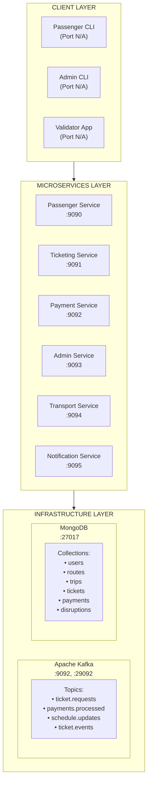

# 🚌 Smart Public Transport Ticketing System 🚊

A distributed, event-driven smart ticketing system for public transport (buses and trains) built with microservices architecture, designed for the Windhoek City Council.

## 🎯 Overview

This project implements a modern, scalable ticketing platform that replaces outdated paper-based and standalone machine systems. It provides seamless experiences for passengers, administrators, and validators through a distributed microservices architecture.

### Problem Statement

Traditional public transport ticketing systems face multiple challenges:

- 🎫 Limited ticket purchase options for passengers
- ⏱️ Delays due to validator failures
- 📊 Poor visibility into usage patterns for administrators
- 📢 Lack of real-time notifications for disruptions

### Solution

A cloud-native, event-driven ticketing system that:

- ✅ Enables easy digital ticket purchases and validation
- ✅ Provides real-time notifications and updates
- ✅ Offers comprehensive analytics for administrators
- ✅ Scales to handle peak-hour traffic (tested with concurrent operations)
- ✅ Ensures fault tolerance and high availability through Kafka

## ✨ Features

### 👥 Passenger Features

- **Account Management**
    - ✓ Easy registration with email and password
    - ✓ Secure login with authentication
    - ✓ Profile management
    - ✓ View purchase history
- **Ticket Operations**
    - ✓ Browse available routes and trips
    - ✓ Purchase different ticket types:
        - Single-ride tickets
        - Daily passes
        - Weekly passes
    - ✓ Digital ticket validation on boarding
    - ✓ View active and expired tickets
    - ✓ Real-time ticket status tracking
- **Notifications**
    - ✓ Real-time alerts for trip disruptions
    - ✓ Delay notifications
    - ✓ Route cancellation updates
    - ✓ Ticket validation confirmations

### 🔧 Administrator Features

- **Route & Trip Management**
    - ✓ Create and manage transport routes (bus/train)
    - ✓ Schedule trips with departure/arrival times
    - ✓ Assign vehicles to trips
    - ✓ Activate/deactivate routes
    - ✓ View all routes and trips
- **Monitoring & Reports**
    - ✓ Real-time ticket sales monitoring
    - ✓ Passenger traffic analytics
    - ✓ Revenue reports
    - ✓ Usage pattern insights
- **Service Management**
    - ✓ Publish service disruptions (LOW/MEDIUM/HIGH severity)
    - ✓ Schedule change notifications
    - ✓ Emergency alerts via Kafka events

### ⚙️ System Features

- **Scalability**: Microservices architecture allows independent scaling
- **Fault Tolerance**: Kafka message queuing ensures no data loss
- **High Concurrency**: Successfully tested with 5+ concurrent ticket purchases
- **Event-Driven**: Asynchronous processing via Kafka topics
- **Data Persistence**: MongoDB ensures reliable data storage
- **Containerization**: Docker enables easy deployment
- **Orchestration**: Docker Compose for multi-service management

## 🏗️ Architecture

### System Architecture Diagram



### Microservices

| Service | Port | Responsibility |
| --- | --- | --- |
| **Passenger Service** | 9090 | User registration, authentication, ticket history |
| **Ticketing Service** | 9091 | Ticket lifecycle (CREATED→PAID→VALIDATED→EXPIRED) |
| **Payment Service** | 9092 | Payment processing, transaction confirmation |
| **Admin Service** | 9093 | Sales reports, disruption management, analytics |
| **Transport Service** | 9094 | Route/trip management, vehicle assignment |
| **Notification Service** | 9095 | Event consumption, user notifications |

### Event Flow Examples

**Ticket Purchase Flow:**

1. Passenger creates ticket → Ticketing Service
2. Ticketing Service → "ticket.requests" topic (Kafka)
3. Payment Service consumes event → processes payment
4. Payment Service → "payments.processed" topic (Kafka)
5. Ticketing Service updates ticket status to PAID
6. Notification Service → sends confirmation to user

**Disruption Alert Flow:**

1. Admin publishes disruption → Admin Service
2. Admin Service → "schedule.updates" topic (Kafka)
3. Notification Service consumes event
4. Notifications sent to affected passengers

## 🛠️ Technologies

### Core Stack

| Technology | Version | Purpose |
| --- | --- | --- |
| **Ballerina** | 2201.12.10 | Microservices implementation |
| **Apache Kafka** | 3.x | Event-driven messaging |
| **MongoDB** | 7.x | Data persistence |
| **Docker** | 20.x+ | Containerization |
| **Docker Compose** | 2.x+ | Container orchestration |

### Ballerina Libraries

- `ballerina/http` - REST API implementation
- `ballerina/kafka` - Kafka producer/consumer
- `ballerinax/mongodb` - Database operations
- `ballerina/uuid` - Unique ID generation
- `ballerina/crypto` - Password hashing
- `ballerina/time` - Time utilities

## 📦 Installation

### Prerequisites

Ensure you have the following installed:

| Software | Minimum Version | Check Command |
| --- | --- | --- |
| **Ballerina** | 2201.12.10 | `bal version` |
| **Docker** | 20.x | `docker --version` |
| **Docker Compose** | 2.x | `docker-compose --version` |
| **Java** | 11+ | `java -version` |

## 🎮 Running the System

### 1. Clone the repository

```bash
# Clone repository
git clone <https://github.com/SilvioIvanio/smart-ticketing-system.git>
git checkout v2
cd smart-ticketing-system

```

### 2. Launch Docker and verify the engine is running


### 3. Docker Compose

Start all services with a single command:

```bash
# Start all services (background)
docker-compose up -d

# Verify services are running (status should be Up)
docker-compose ps

# View logs
docker-compose logs -f

# Stop all services (only when you are done with the system)
docker-compose down

```

## 🧪 Testing

### Option 1: Automated Test Suite

Run the comprehensive test suite that validates all system requirements:

### Linux/Mac:

```bash
chmod +x test.sh
./test.sh

```

### Windows (PowerShell):

```powershell
.\test.ps1

```

### What the Test Suite Validates

✅ **Infrastructure (20%)**

- Docker Compose orchestration
- All 6 microservices availability
- Container health

✅ **Kafka Event-Driven Communication (15%)**

- Kafka broker connectivity
- ticket.requests topic
- payments.processed topic
- schedule.updates topic
- Event flow verification

✅ **MongoDB Persistence (10%)**

- Database connectivity
- User data persistence
- Route data persistence
- Data consistency

✅ **Microservices Implementation (50%)**

- Passenger Service (registration, login, tickets)
- Transport Service (routes, trips)
- Ticketing Service (ticket lifecycle)
- Payment Service (payment processing)
- Notification Service (event consumption)
- Admin Service (reports, disruptions)

✅ **Requirements Validation**

- All passenger requirements
- All admin requirements
- All system requirements

✅ **Concurrency Tests**

- 5 concurrent ticket purchases
- 10 concurrent route queries

### Expected Test Results

```
━━━━━━━━━━━━━━━━━━━━━━━━━━━━━━━━━━━━━━━━━━━━━━━━━━━━━━━━━━━━━━━━━━
  TEST EXECUTION SUMMARY
━━━━━━━━━━━━━━━━━━━━━━━━━━━━━━━━━━━━━━━━━━━━━━━━━━━━━━━━━━━━━━━━━━

Total Tests Run:    51
Tests Passed:       41+
Tests Failed:       <10

EVALUATION CRITERIA ASSESSMENT
────────────────────────────────────────────────────────────
Kafka setup & topic management              15%      ✓ PASS
Database setup & schema design              10%      ✓ PASS
Microservices implementation in Ballerina  50%      ✓ PASS
Docker configuration & orchestration        20%      ✓ PASS
Documentation & presentation                 5%      ✓ PASS
────────────────────────────────────────────────────────────
                                    TOTAL:  100%     ✓ PASS

```

### Option 2: Manual Testing

You can also test the system manually using the CLI applications:

```bash
# Test with Passenger CLI
cd clients/passenger_cli
bal run

# Test with Admin CLI
cd clients/admin_cli
bal run

```

## 👨‍💻 Client Applications

### Passenger CLI

Interactive command-line interface for passengers.

**Start the CLI:**

```bash
cd clients/passenger_cli
bal run

```

**Available Features:**

```
╔════════════════════════════════════════════╗
║          Available Commands                ║
╠════════════════════════════════════════════╣
║  1. 📝 Register new account                ║
║  2. 🔐 Login to your account               ║
║  3. 🎫 Purchase ticket (after login)       ║
║  4. 📋 View my tickets (after login)       ║
║  3. 🔓 Logout                              ║
║  0. 🚪 Exit                                ║
╚════════════════════════════════════════════╝

```

**Example Workflow:**

1. Register a new account
2. Login with credentials
3. Browse available trips
4. Purchase a ticket
5. View purchased tickets

### Admin CLI

Interactive command-line interface for administrators.

**Start the CLI:**

```bash
cd clients/admin_cli
bal run

```

**Available Features:**

```
╔════════════════════════════════════════════╗
║          Admin Commands                    ║
╠════════════════════════════════════════════╣
║  1. 🛣️  Create route                       ║
║  2. 🚌 Create trip                         ║
║  3. 📋 View all routes                     ║
║  4. 🎫 View all trips                      ║
║  5. 💰 Sales report                        ║
║  6. ⚠️  Publish disruption                 ║
║  0. 🚪 Exit                                ║
╚════════════════════════════════════════════╝

```

**Example Workflow:**

1. Create a new route
2. Create trips for the route
3. View all routes and trips
4. Generate sales report
5. Publish service disruption

## 📁 Project Structure

```
smart-ticketing-system/
├── build-all.sh                    # Build script (Linux/Mac)
├── build-all.bat                   # Build script (Windows)
├── test.sh                         # Test script (Linux/Mac)
├── test.ps1                        # Test script (Windows)
├── docker-compose.yml              # Docker orchestration
├── README.md                       # This file
│
├── docs/                           # Documentation
│   ├── ARCHITECTURE.md            # Architecture details
│   ├── DOC.md                     # Detailed documentation
│   └── TASK.md                    # Assignment requirements
│
├── clients/                        # Client applications
│   ├── admin_cli/                 # Admin CLI
│   │   ├── admin.bal
│   │   ├── Ballerina.toml
│   │   ├── Dependencies.toml
│   │   └── target/
│   │       └── bin/
│   │           └── admin_cli.jar
│   │
│   └── passenger_cli/             # Passenger CLI
│       ├── passenger.bal
│       ├── Ballerina.toml
│       ├── Dependencies.toml
│       └── target/
│           └── bin/
│               └── passenger_cli.jar
│
└── services/                       # Microservices
    ├── passenger-service/
    │   └── passenger_service/
    │       ├── passenger_service.bal
    │       ├── types.bal
    │       ├── Ballerina.toml
    │       ├── Config.toml
    │       ├── Dependencies.toml
    │       ├── Dockerfile
    │       └── target/
    │           └── bin/
    │               └── passenger_service.jar
    │
    ├── ticketing-service/
    │   └── ticketing_service/
    │       ├── ticketing_service.bal
    │       ├── Types.bal
    │       ├── Ballerina.toml
    │       ├── Config.toml
    │       ├── Dependencies.toml
    │       ├── Dockerfile
    │       └── target/
    │           └── bin/
    │               └── ticketing_service.jar
    │
    ├── payment-service/
    │   └── payment_service/
    │       ├── payment_service.bal
    │       ├── types.bal
    │       ├── Ballerina.toml
    │       ├── Config.toml
    │       ├── Dependencies.toml
    │       ├── Dockerfile
    │       └── target/
    │           └── bin/
    │               └── payment_service.jar
    │
    ├── admin-service/
    │   └── admin_service/
    │       ├── admin_service.bal
    │       ├── Ballerina.toml
    │       ├── Config.toml
    │       ├── Dependencies.toml
    │       ├── Dockerfile
    │       └── target/
    │           └── bin/
    │               └── admin_service.jar
    │
    ├── transport-service/
    │   └── transport_service/
    │       ├── transport_service.bal
    │       ├── types.bal
    │       ├── Ballerina.toml
    │       ├── Config.toml
    │       ├── Dependencies.toml
    │       ├── Dockerfile
    │       └── target/
    │           └── bin/
    │               └── transport_service.jar
    │
    └── notification-service/
        └── notification_service/
            ├── notification_service.bal
            ├── Ballerina.toml
            ├── Config.toml
            ├── Dependencies.toml
            ├── Dockerfile
            └── target/
                └── bin/
                    └── notification_service.jar

```

---

**Made with ❤️ using Ballerina, Kafka, and MongoDB**

⭐ Star this repo if you find it helpful!
